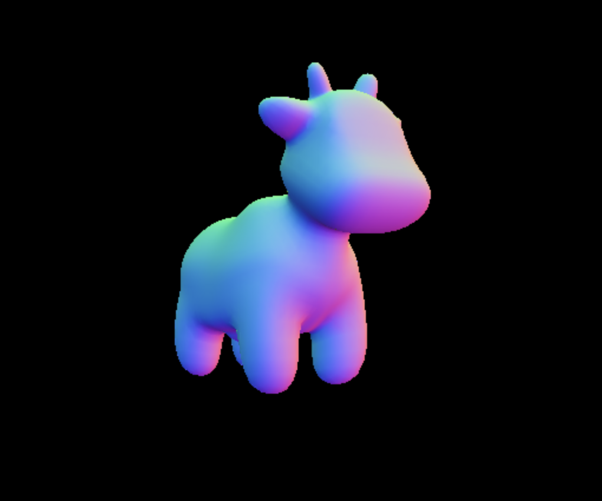
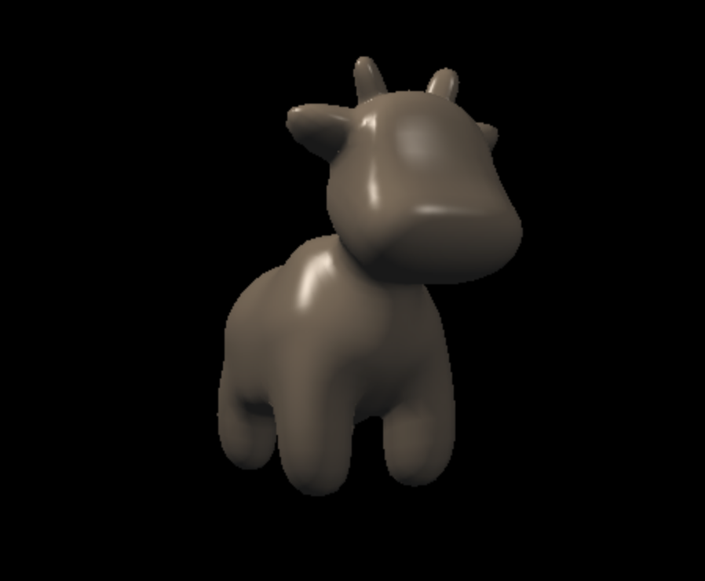
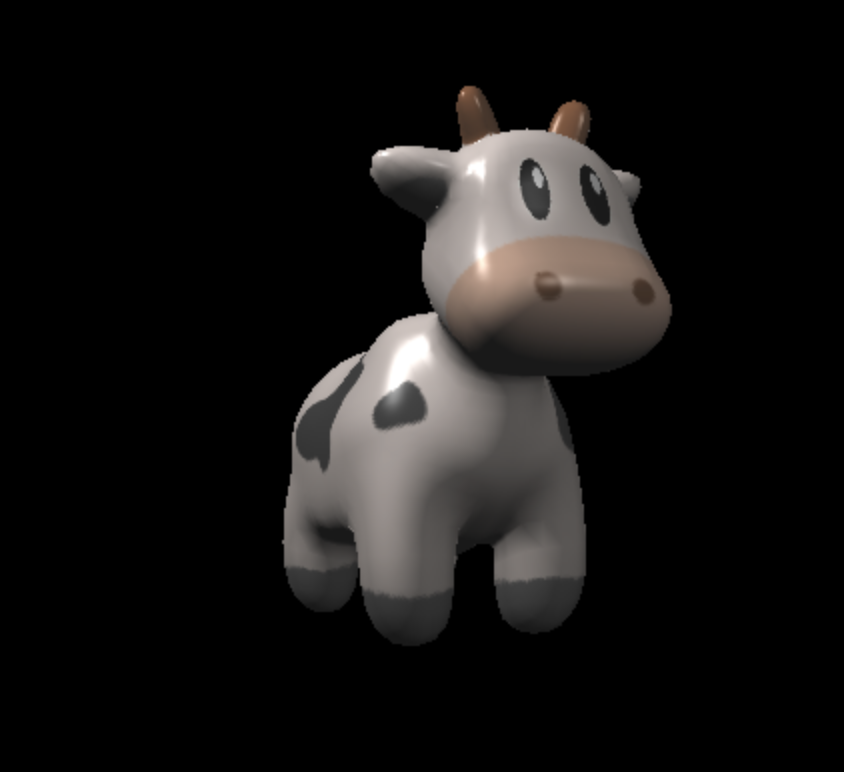
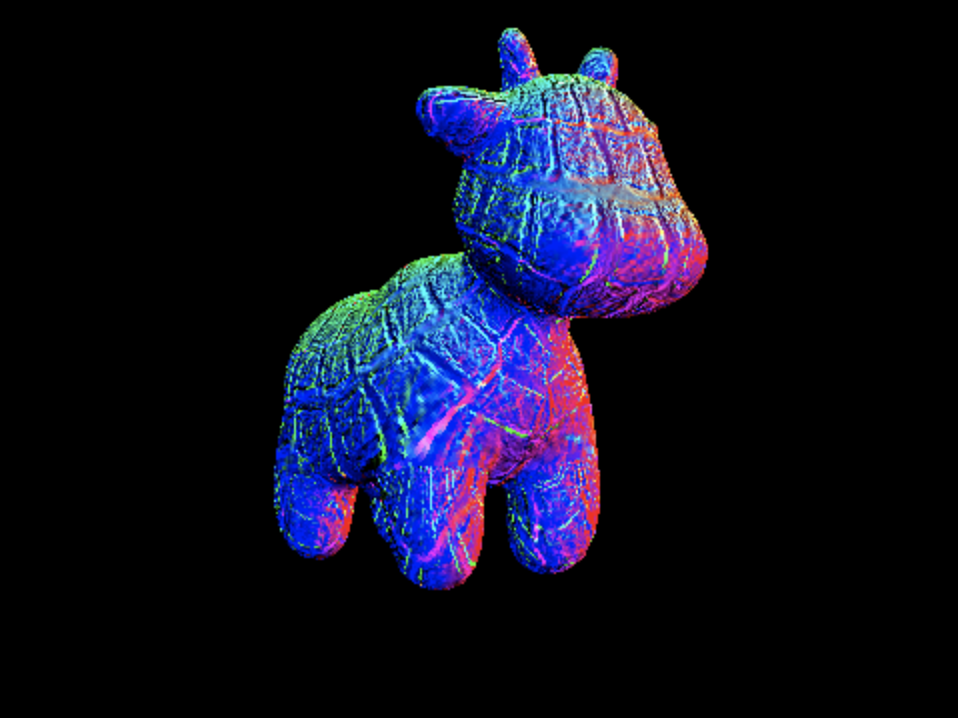
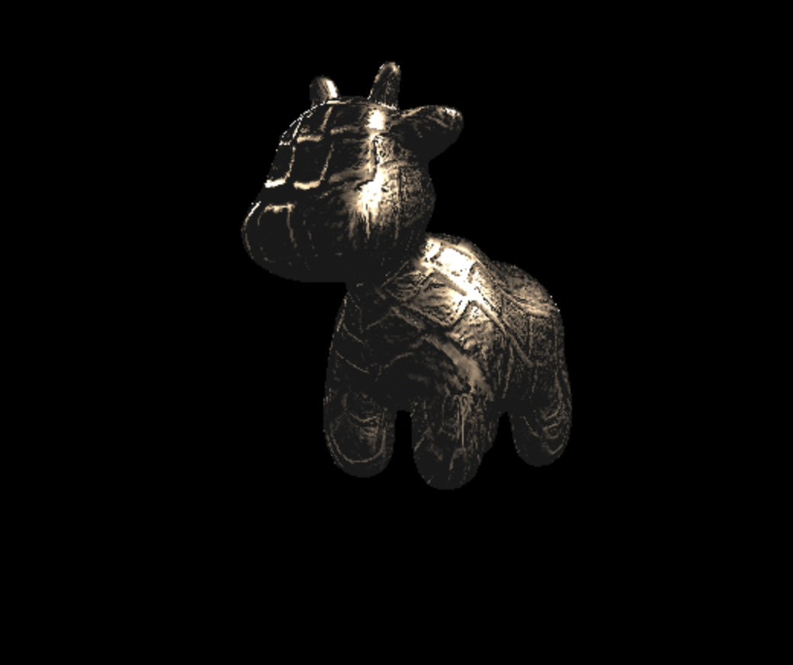
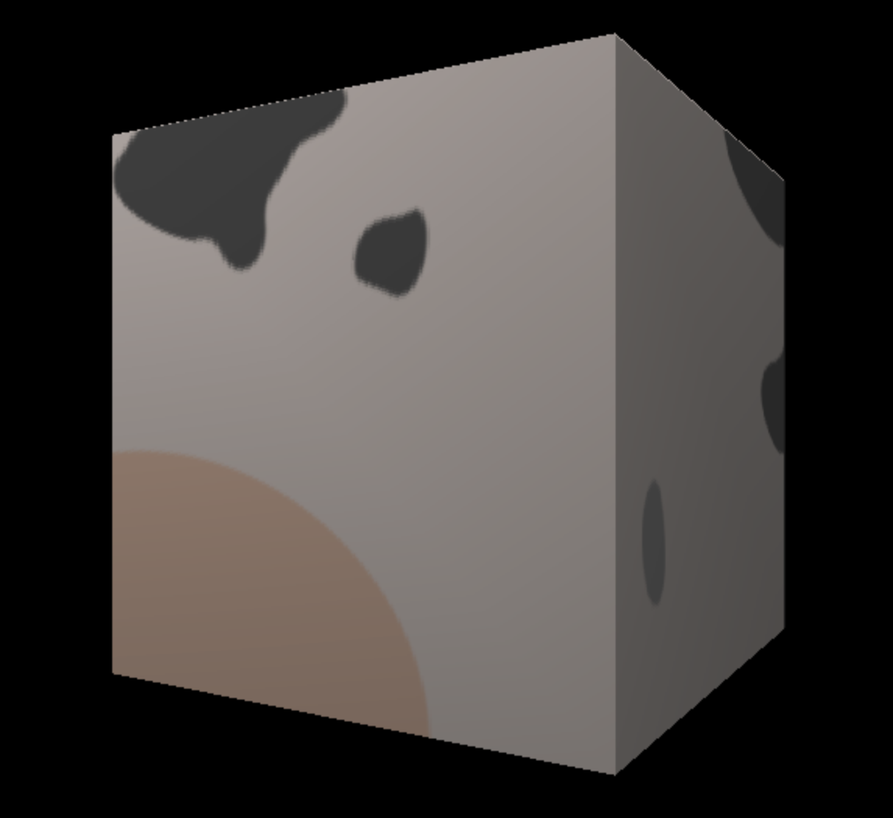
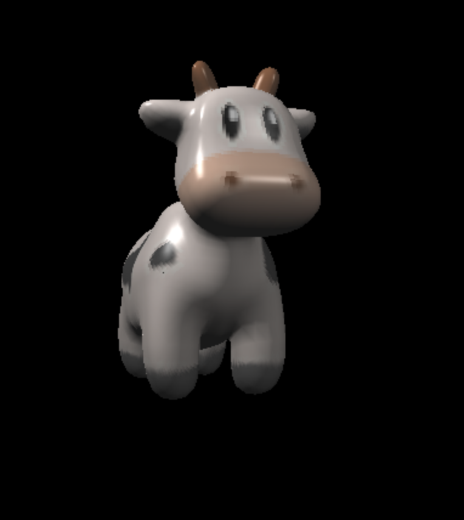
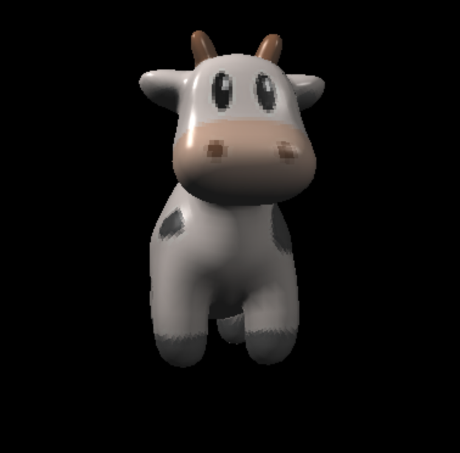

---

### 李梦凡同学**已完成**提高题，程序运行展示的是phong反射模型。

得分点完成情况：

1. 完成
2. 完成
3. 完成
4. 完成
5. 完成
6. 完成
7. 完成

下面展示结果图

# 1. normal shader

# 2. phong shader

# 3. texture shader

# 4. bump shader

# 5. displacement shader

# 6. other obj

使用的是代码框架自带的cube.obj和奶牛的贴图

# 7. texture getColorBilinear shader

把纹理图片从1024X1024压缩到了256X256，分别展示使用getColorBilinear和不使用getColorBilinear的结果，可以明显的看到鼻孔和眼眶处的锯齿优化了一点

## 使用 getColorBilinear

## 不使用 getColorBilinear

