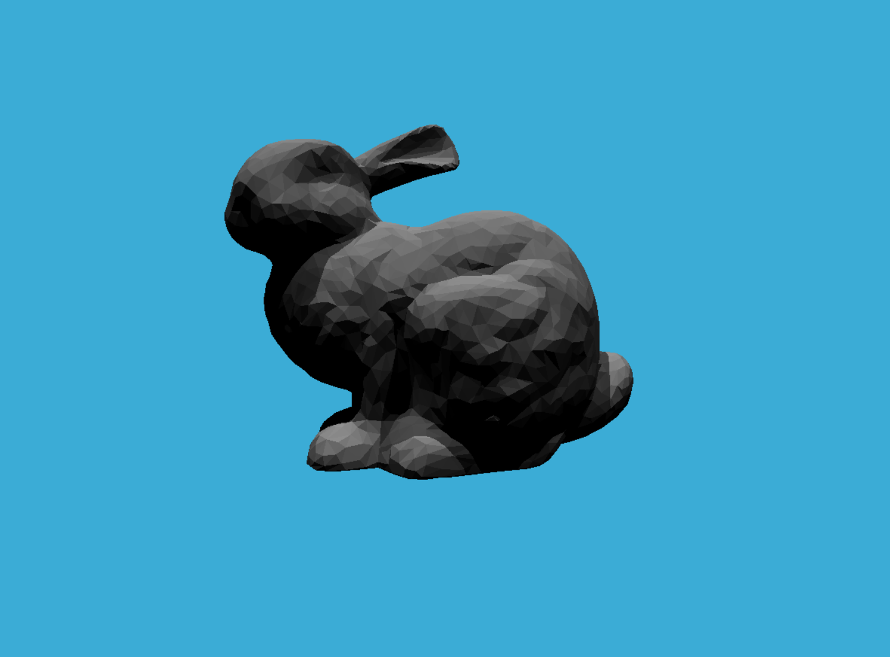

---

李梦凡同学已完成作业

得分点完成情况：

1. 完成（格式正确，5分）
2. 完成（包围盒求交，20分）
3. 完成（BVH 查找，15分）
4. 完成（SAH 查找，25分）

下面展示结果图



## SAH 实现方法

> SAH 参考：https://www.cnblogs.com/lookof/p/3546320.html

主要思路：沿用 NAIVE 的实现方法，通过一个 midIndex 将 objects 分为两部分，不过这个midIndex使用类似梯度下降的方式确定。（实现为`recursiveBuildSAH`方法）

1. 首先选择 midIndex=size/2（初始值），根据`computeSAHCost`（新增方法）计算 Cost，之后计算 midIndex + 1 和 midIndex - 1 的 Cost。
2. 如果 midIndex 的 Cost 为三者最小则直接返回。
3. 否则使用`tryBuildSAH`（新增方法）逐一计算+1或-1方向（最小值的方向）的 Cost 直到找到 Cost 的拐点，并以此拐点作为 midIndex。

## 效果对比

> 下面展示了不使用 BVH，使用 NAIVE 的 BVH 和 SAH 的 BVH 的输出，由于模型太小，电脑配置太高，所以增加了 ms 单位。（程序默认执行使用 NAIVE 的 BVH 方法）
> 试验机器：操作系统是macOS Mojave 10.14.6，处理器是2.2 GHz Intel Core i7，内存是16 GB 2400 MHz DDR4。（简称2019新版MacBook Pro）

1. 不使用 BVH

通过修改代码的所有`#if 0`为`#if 1`可以关闭 BVH 直接渲染，可以看到渲染好慢。

```c++
BVH Generation complete: 
Time Taken: 0 hrs, 0 mins, 0 secs, with primitives size: 4968

 - Generating BVH...

BVH Generation complete: 
Time Taken: 0 hrs, 0 mins, 0 secs, with primitives size: 1

Render complete: 
Time taken: 0 hours
          : 8 minutes
          : 533 seconds
```

2. 使用 NAIVE 的 BVH （默认使用）

```c++
BVH Generation complete: 
Time Taken: 0 hrs, 0 mins, 1 secs, total 304.397000 ms, with primitives size: 4968

 - Generating BVH...

BVH Generation complete: 
Time Taken: 0 hrs, 0 mins, 0 secs, total 0.004000 ms, with primitives size: 1

Render complete: 
Time taken: 0 hours
          : 0 minutes
          : 3 seconds
total     : 3470.84 ms
```

3. 使用 SAH 的 BVH

通过修改代码的`TODO SAH`位置的`BVHAccel::SplitMethod::NAIVE`为`BVHAccel::SplitMethod::SAH`可以开启 SAH 的 BVH 渲染。

对比效果上来看：
    1. SAH 方法在建树操作上确实慢了一点
    2. SAH 方法在渲染速度上确实快了一点

```c++
BVH Generation complete: 
Time Taken: 0 hrs, 0 mins, 0 secs, total 336.938000 ms, with primitives size: 4968

 - Generating BVH...

BVH Generation complete: 
Time Taken: 0 hrs, 0 mins, 0 secs, total 0.023000 ms, with primitives size: 1

Render complete: 
Time taken: 0 hours
          : 0 minutes
          : 3 seconds
total     : 3143.74 ms
```