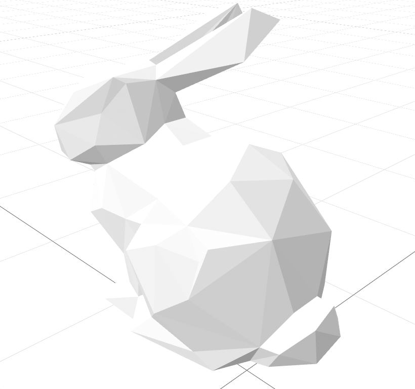
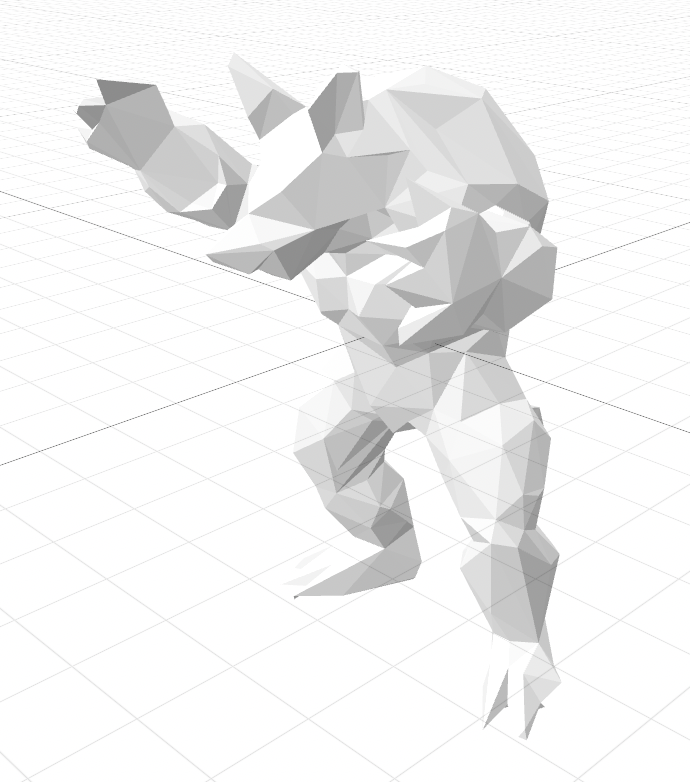
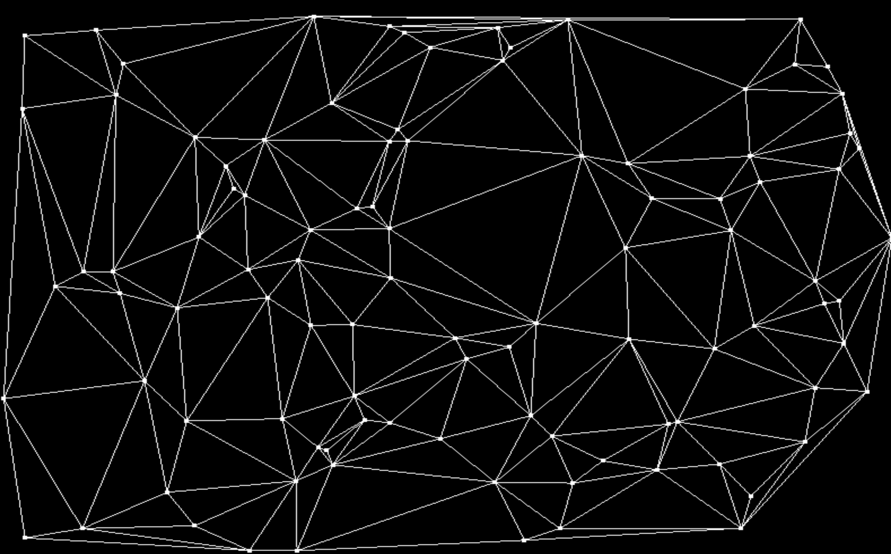

# 李梦凡选题为：网格简化及重新网格化 (难度等级: 1.5)

因为时间紧迫所以选择了一个较为简单的题目

视频展示百度云链接：

```
链接:https://pan.baidu.com/s/1PfhzgoX5p1yrMO-_wbBDOg  密码:peb2
```

## 网格简化（MeshSimpler）

使用边坍缩算法

1. 计算出所有面的Kp矩阵
2. 读取所有边，并计算所有边的Q矩阵，同时计算出坍缩为点之后的代价最小的点和代价值，这里矩阵求逆使用Eigen实现
3. 所有的边存储在堆中，每次取出一个代价最小的边，用上一步中计算出的点代替，同时删除两个面，并更新相连接的面的Kp矩阵，并插入新增的边
4. 重复步骤3直到达到简化的要求

> 在`MeshSimpler/models/output`下存储简化后的模型

- 展示简化 bunny.obj 面片数为原来的0.05



- 展示简化 armadillo.obj 面片数为原来的0.01




## 重新网格化（Delaunay）

使用Delaunay算法对点云进行网格化

伪代码为：

```c++
function BowyerWatson (pointList)
      // pointList is a set of coordinates defining the points to be triangulated
      triangulation := empty triangle mesh data structure
      add super-triangle to triangulation // must be large enough to completely contain all the points in pointList
      for each point in pointList do // add all the points one at a time to the triangulation
         badTriangles := empty set
         for each triangle in triangulation do // first find all the triangles that are no longer valid due to the insertion
            if point is inside circumcircle of triangle
               add triangle to badTriangles
         polygon := empty set
         for each triangle in badTriangles do // find the boundary of the polygonal hole
            for each edge in triangle do
               if edge is not shared by any other triangles in badTriangles
                  add edge to polygon
         for each triangle in badTriangles do // remove them from the data structure
            remove triangle from triangulation
         for each edge in polygon do // re-triangulate the polygonal hole
            newTri := form a triangle from edge to point
            add newTri to triangulation
      for each triangle in triangulation // done inserting points, now clean up
         if triangle contains a vertex from original super-triangle
            remove triangle from triangulation
      return triangulation
```

这里使用随机生成的100个点，使用SFML展示网格化的效果

